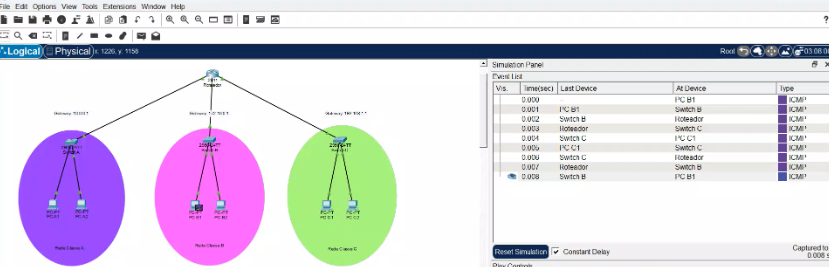

# Packet-tracer----lab_Roteamento-Inter-Redes-A-B-C
Estudos de Roteamento e Redes
##  Visão Geral

Este laboratório foi desenvolvido utilizando o **Cisco Packet Tracer** com o objetivo de praticar conceitos fundamentais de **redes de computadores, endereçamento IP, roteamento e segmentação de redes**.

A atividade simula uma infraestrutura de rede composta por diferentes segmentos interconectados por dispositivos de rede, permitindo a aplicação prática dos conceitos estudados.

## Topologia e Arquitetura de Rede

